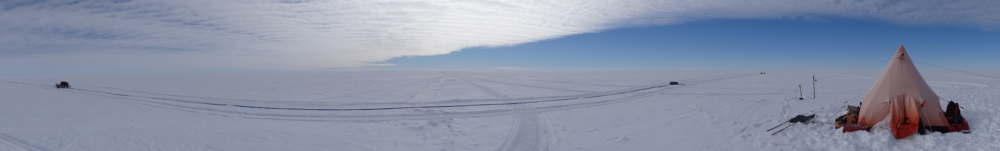

Download this document as a pdf [here](https://github.com/ldeo-glaciology/ITGC-field-doc/raw/042e9c0e25666b68868f82028d11842a0fdc07bf/index.pdf).

## 1. Introduction
This document describes recommendations for best practices for field- and ship-based scientific campaigns in Antarctica, undertaken as part of the International Thwaites Glacier Collaboration (ITGC). Its intended audience is all members of the ITGC’s field and ship teams, regardless of career-stage, role in the team, seniority, or previous experience. These best practices are based on evidence from the behavioral science and psychology literature and intended as suggestions to help teams improve the climate of their field and ship teams. One overarching goal of providing these recommendations is to improve the diversity of field- and ship-going science teams by creating a safe and welcoming environment for everyone, but particularly those from groups historically marginalized in field- and ship-based science. This will be a living document that will be updated as best practices are refined throughout the ITGC. In addition, only some of the ITGC’s work takes place on ships and in the field, and efforts are ongoing to extend this document to cover our work in the laboratory and in the office. These recommendations are based around defining the structure of the team and what you can do before and after deployment to foster a good team climate. 

## 2. The benefits of good team climate 
The primary purposes of fieldwork and ship-based science is advancing scientific understanding. This document starts from the premise that science outcomes are better when teams foster an environment:

* that empowers and values all team members, no matter their background or seniority,
* that creates a sense of belonging in all team members,
* that creates a sense of shared ownership of the scientific outcomes,
* that has a clear and shared leadership structure,
* that has clear expectations for each team member’s responsibilities,
* that encourages effective communication between all team members, 
* that encourages reporting and ensures accountability for bad behaviour,
* where everyone knows and respects each other’s rights and the team’s values, and
* where everyone can identify and call out behaviour which harms efforts to maintain this environment. 

Members of a field or ship-based team that lacks these characteristics or puts no effort into fostering them are more likely to be disengaged, make costly mistakes, engage in harassment, or leave the geosciences. In such cases, the leader and some team members may be unaware of these negative impacts or seek to blame the excluded field team member for these behaviors. Beyond its positive impact on individual science projects, fostering supportive, respectful teams benefits our scientific community by improving retention of junior scientists, particularly those from historically marginalized groups. 

Due to the benefits to our community and to the science conducted by our teams, this document advocates for ITGC science teams operating in the field and on ships to dedicate a comparable amount of thought, group discussion, and planning to team climate as we do to planning data collection. As described below, this can involve frank group discussions before and during deployment, critical self-assessment (including by senior team members), establishing a “shared leadership structure'', signing a group-edited agreement on the rights of team members and acceptable behaviour, and ensuring everyone is aware of reporting procedures. 

## 3. Team structure
This section covers assembling your team, defining a shared leadership structure and defining clear roles and responsibilities, all of which are important components of fostering a successful team climate. 

**Membership of the field/ship team**: The membership of the field team is dictated by many factors, some of which are outside the control of the project. This notwithstanding, it is important to ensure that we are not excluding people from the important professional development opportunities associated with participation in field and ship work. Therefore, we suggest that:

* Decisions to include, exclude, add, and/or remove members of a field team are made collectively by the project team (i.e. all the members of the project of which the ship or field work is a component of). 
* These decisions are made while carefully considering opportunities to enhance inclusivity and diversity, without compromising the scientific goals of the project. Consider diversity in terms of field/ship experience, gender, ethnicity and race, when choosing the team. For example, aim for gender balance whenever possible and when the requirements of the work allow, priority can be given to those with little or no field/ship experience. 
* As long as the key technical/science needs are met, team membership should not be limited by “outdoor experience” or “athleticism” - instead, it needs to be inclusive of those who want the experience and are willing to be challenged if it will benefit their career. Set the culture of the team to embrace and support those who are new to field and ship work, and make accommodations as necessary to support any disability or other medical conditions (as long as they are able to pass the relevant pre-field medical).    

**The assignment of field leader(s)**: Every team needs to have one or multiple designated leaders. Often having a “science” team leader and a “safety/medical” team leader can distribute leadership effectively, with one person being designated the overall leader. The overall leader is the point of contact for logistical decisions and is responsible for the overall success of the field or ship work, and may not be the PI of the project or the most senior member of the team. Additionally, either the science lead, the safety lead, or another team member can be given special responsibility for team climate. They can be the person others go to initially with concerns related to the issues discussed in this document, and can be charged with paying particular attention to and be empowered to call out behaviour that impedes the group’s efforts to create and sustain a good team climate. The choice of personnel for all three roles will ideally be the decision of the whole project team, and should be made based on open discussion and potentially difficult self-reflection on the part of all team members. For example, depending on the team, the most senior scientist may not simultaneously be the most qualified to be science lead and the person responsible for team climate. Potential difficulties arising from the power dynamics generated by these multiple roles being held by different people can be preempted and minimized through discussion before and during deployment. 

**Roles and responsibilities**: When assigning roles and responsibilities, a shared leadership structure can be established by ensuring each team member has a duty/area that they are primarily responsible for and can take a degree of ownership over, while feeling reassured that they can delegate or ask for help when needed. All team members should contribute to daily camp duties (e.g., cooking, cleaning) regardless of seniority. The field team leader is responsible for assigning responsibilities, both scientific tasks and camp duties. While some members are poised to take on more responsibilities than others, or have different skills than others, it is important that the overall effort is shared evenly, and that all tasks are viewed with equal importance. 

## 4. Pre-deployment 
Regular meetings of the entire team prior to deployment can be an effective way to improve team climate during deployment. As well as covering science topics, we suggest that these meetings focus on making everyone aware of the issues discussed in this document, establishing group values and acceptable behaviour, reducing anxiety and uncertainty, sharing decision making from the start of the campaign, and team building. Ideally, at least one in-person meeting of the whole team should be arranged. This section outlines some of the issues to address. 
 
**Establishing team values**: Use these meetings to establish the values that are important to the group. This can be achieved by distributing and encouraging people to read this document prior to an in-person meeting at which the team collectively discusses the issues it covers. Do the same for the resources listed in the further reading section. These additional documents cover important topics like group formation; leadership; group, interpersonal and intrapersonal dynamics; and decision making. 

One way to facilitate these discussions and to definitively establish team values and norms is with a **team agreement** document. Consideration of this document could be a key part of one of your in-person pre-deployment meetings. Appendix A contains an example team agreement. It is a list of rights and norms that can be distributed prior to the meeting, then collectively read, discussed, amended, and signed at the meeting. Amendments may be necessary due to specifics of the project or personal preferences of the team. Each item in the list should be discussed and agreed upon, ideally unanimously.
The purpose of this exercise is to set clear expectations of behaviour so that everyone knows what is acceptable, removing ambiguity surrounding these topics and giving everyone a chance to reflect on how they can foster a good group dynamic. As discussed above, this is key to a successful, happy and effective science team. Signing this document amounts to a commitment to uphold the agreement. Everyone is responsible for upholding the agreement regardless of their seniority in the team. 

**Reducing uncertainty/information sharing**: Another priority of pre-deployment meetings should be reducing the anxiety associated with uncertainty regarding life in the field or on ship. Discussing each of the following topics, even if they are well known to senior team members, will help to reduce anxiety and prevent conflicts that could arise due to these aspects of field or ship life.

*Goals*: Open discussion of scientific and safety goals at the pre-deployment meeting will help ensure everyone is engaged in the campaign’s success. This should involve everyone. For example, involve everyone in science discussions, including those responsible primarily for safety or logistics, e.g., field guides. Conversely, everyone should engage in safety discussions; ensure that everyone understands how to respond to emergencies and define what a proactive risk management culture looks like for your team. This could include twice-daily briefings during deployment, discussion of incident reporting procedures, including near-misses, safety and leadership nuggets (what is your team already doing well that helps prevent incidents, call out specific examples of proactive behavior within the team, and/or share personal stories as it relates to field risk management). 

*Responsibilities*: Openly discuss the distribution of responsibilities during pre-deployment meetings. Responsibilities can be adjusted during deployment, but starting with clear roles and responsibilities around science and safety will help to reduce uncertainty and anxiety, particularly in those new to field- or ship-based science. 

*Decision making*: Discuss the various styles of decision making, who is involved in making decisions, which styles are most effective in different situations, and how the group envisions decisions being made during deployment. Having an awareness of these styles and implementing them appropriately can prevent disagreements and will help foster an atmosphere of shared leadership.

*Reporting*: Discuss procedures for reporting harassment, abuse, or other behavior that violates the codes of conduct of the agency supporting your campaign. Details of contacts within the United States Antarctic Program and the British Antarctic Survey are provided below. 

*Daily life during deployment*: Discuss everyday life on the ship, at a research station and/or in the field. This will reduce anxiety in new team members and could include discussion of the physical demands of ship/field work; a typical daily schedule; the availability of communications equipment, what to pack; bathroom procedures and bodily functions; food (what food is available and how and when it will be prepared); and rest day schedules. Clearly outlined expectations of the physical demands of life on a ship or in the field help people prepare physically and to identify when they are being pushed physically to an unreasonable and/or dangerous degree. Everyone should have easy, unsupervised and unregulated access to communications devices. The benefits of this for the physical and emotional safety of the team outweigh the risks of overuse, which can be mitigated with discussion of reasonable usage. Team members with more experience of relevant field or ship work can share packing lists with newer team members. Respect for everyone's bodily functions is of utmost importance. Emphasize this in the meeting and discuss any scenarios where privacy for performing bodily functions may be limited. Finally, rest days should be built into all field and ship campaigns. Weather often dictates rest-day schedules, but this introduces uncertainty. Instead, as a group decide on a regular rest-day schedule that will be followed except in unusual circumstances. 

*In-season check-in meetings*: At the pre-deployment meeting establish a mechanism for the leadership to receive feedback and for the group to make necessary course corrections during deployment. This can be in the form of daily check-in meetings during deployment, so information can be easily disseminated, and less frequent meetings dedicated to reevaluating the issues covered by this document. 

Finally, a key policy that we recommend reiterating at the pre-deployment meeting is that no one can be compelled to do anything they do not want to do. And they do not need to divulge or justify their reasons. 

## 5. After deployment
Gathering feedback on the success or otherwise of strategies employed to improve the inclusivity and climate of ITGC ship and field teams, is useful for each team and the whole ITGC to continue to improve these efforts. Two simple ways to do this are to hold a debrief meeting following deployment and to complete the field season survey administered annually by the Science and Communication Office (SCO). 

Immediately following your time in the field or on ship, a full-team debrief meeting will give everyone the chance to reflect and give feedback on what worked and what did not work in efforts to ensure a good team climate. Ideally, this will be led by a trained facilitator, if available. The SCO can advise if such a training individual is available for your team. This meeting can be held remotely once everyone has returned to their home institution, and ideally involve all team members, including mountaineers and others who are not part of the core science team. Everyone should be encouraged to speak openly about their perspectives on team climate, covering the issues mentioned in this document and others. Collectively ask if the team agreement was followed at all times. If it was not, analyze what failed to allow this to happen. Any other issues that arose regarding, for example, safety, interpersonal dynamics, sharing of camp maintenance tasks, or communication, should also be covered. All such concerns should be taken seriously, reflected upon, and noted by the team leadership. Notes should be shared (after anonymization) with the SCO. Combined with the results of the annual field season survey, these notes will help the SCO and others within ITGC to improve this document, designing new best practices to improve field and ship experiences. Moreover, post-deployment meetings will allow team members - including leaders and future leaders - to reflect on and improve their efforts to foster a safe and inclusive work environment.  

## 6. Contacts
While the majority of conflicts can be addressed within the team, in the event that an incident occurs and you are not comfortable talking to anyone in your team, you can also contact the following people at the British Antarctic Survey (BAS) and the United States Antarctic Program (USAP).  

**BAS contacts:**

Rothera Summer Stations Leader (details in "Contact List for personnel going South" supplied in BAS pre-deployment training)
Rother Doctor (details in "Contact List for personnel going South" supplied in BAS pre-deployment training)
BASMU - British Antarctic Survey Medical Unit (details in "Contact List for personnel going South" supplied in BAS pre-deployment training)

**USAP contact:**

Terry Melton: National Science Foundation McMurdo Station Representative - 
tmelton@nsf.gov, +1 (703) 292-8032

Your university, research institute, or employer may also have a contact person for support during deployment. Each member of the team should note the contact details of this person before deployment.

## 7. Further reading

* This publicly accessible [directory](https://drive.google.com/drive/folders/1IE5XKr1ifpPrAZi0-k_Y2BrfLK8Uevx5?usp=sharing) contains documents for further reading that cover decision making, group forming, and additional ideas about how to create a positive environment in the field.    

* To assist in creating your own code of conduct (which is a different and more focussed document than the team agreement we advocate for here), The Association of Polar Early Career Scientists website hosts a fieldwork code of conduct [template](https://www.apecs.is/career-resources/diversity-equity-inclusion/field-code-of-conduct.html). 

* Erin Pettit hosts a useful [website](https://exploreice.org/field-team-leadership) on field team leadership. 

Please email Jonny Kingslake ([j.kingslake@columbia.edu]()) or the SCO ([betsys@nsidc.org]()) if you would like to add resources to this list or the publicly accessible directory of documentation. Alternatively contribute via the Github repository that underlies this website [here](https://github.com/ldeo-glaciology/ITGC-field-doc).

## Appendix: Example team agreement

**All team members have the right**:

1. To have their opinions heard and considered on all issues, including: safety, scientific, logistical, interpersonal etc.
2. To be informed about the plans, nature of work and risks involved with work in which they will be participating.
3. To freely express concerns about their safety and comfort, and that of the team (e.g., dangerous camping sites, inadequate rest or sleep, inadequate crevasse safety measures etc.).
4. To refuse to take part in activities they feel are unsafe or they are not comfortable with (e.g., working in a storm, flying in bad weather, driving an ATV/snowmobile without training, crossing a glacial stream, ascending a snow slope under avalanche conditions, etc.) and they do not need to justify their reason for feeling this way. 
5. To accommodation with a person or person whom they are comfortable with (e.g. no one should be required to share accommodation with a person with whom they are not comfortable).
6. To a social environment that would be acceptable in a classroom or office setting (e.g., jokes, language and behavior not acceptable on a university campus or in an office are not acceptable on a ship or in the field).
7. To adequate shelter, equipment and food.
8. To not be left alone in remote field settings unless they are comfortable and are safe doing so.
9. To carry and use remote field safety equipment, including communication devices - this may include radios, satellite phones, and InReach-like devices. Everyone should have access to communication equipment without supervision or limitations. 
10. To request and obtain training for field safety issues and tasks from the leaders of the team, other team members, or the responsible research support station (e.g., in glacier-travel or use of scientific equipment etc.).
11. To be evacuated at no cost, if the team member feels a Title VII or Title IX violation has occurred and wants to leave the field for safety reasons and/or to file a complaint (e.g., harassed because of gender, belittled because of religious background or nationality, sexual harassment, etc.).
12. To rest periods or a rest day every 5-6 days. 
13. To an environment free from unacceptable behaviour, including
* Physical or verbal abuse or assault
* Intimidation
* Coercion/Manipulation
* Threats (including but not limited to threats of violence, professional discreditation, unwarranted decreases in responsibilities, and public embarrassment.)
* Gender, race-based, age-based, or sexual harassment
* Sexual misconduct
* The use of hate speech.
* Behavior that endangers the mental or physical health and safety of oneself or others
* Dangerous driving
* Disregard for the personal property of others
* Repeatedly disregarding responsibilities

All of these rights apply to all members of the team and shall be exercised without any form of personal or professional retaliation. Any team members found to be violating these rights may be removed from the team.

### Example additions made in preparation for ITGC Fieldwork
[To be replaced/adjusted in consultation with all team members]

**In departure city**:
* Moderate and responsible alcohol consumption allowed.
* Furnishing alcoholic beverages to any person under the age of 21 is not allowed.
* Respect the privacy of team member’s rooms. Do not go into someone’s room without their permission nor disturb a team member in their room unnecessarily.
* Follow the rules for the hotels, dormitories, etc, including respecting the property, bathroom policies, etc.

**On the ice sheet**:
* No consumption of illegal drugs; alcohol consumption should be moderate and responsible. 
* During extreme weather days - the team will stay in camp. This is subject to the decision of the group. No team member is required to work in poor weather.

**Both in departure city and and in the field**:
* Responsible and respectful conduct is expected.
* All team members have the responsibility to report all instances of unacceptable conduct as defined above to the appropriate party and see that the issue is fully addressed. Any bystander that does not report unacceptable conduct is subject to review by the team members and may also be terminated from fieldwork. This includes any actions to inhibit, discredit, stop, or falsify the investigation of a misconduct case. All instances of misconduct require reporting no matter the severity.
* All parties are responsible for maintaining the anonymity of a victim of misconduct if requested by the victim.
* At all stages of an instance of misconduct, the victim is to be presumed truthful and serious unless overwhelming evidence proves otherwise.
* It is ok to take a time-out and rest if you are physically/mentally exhausted and take a rest day. However, the rest of the team may continue working

By signing below, you agree to the following code of conduct and accept the consequences of violating them. This may include the termination from the project.

_________

	
